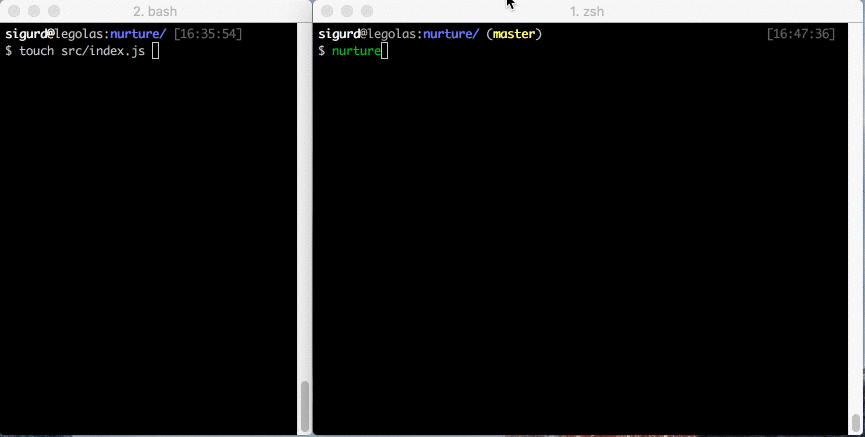

# nurture [![travis][travis-image]][travis-url] [![npm][npm-image]][npm-url]
[travis-image]: https://img.shields.io/travis/laat/nurture.svg?style=flat
[travis-url]: https://travis-ci.org/laat/nurture
[npm-image]: https://img.shields.io/npm/v/nurture.svg?style=flat
[npm-url]: https://npmjs.org/package/nurture

> Define watches with with your source files



Create `.watch` definition files with your source files, and watch for changes.
A perfect fit for monorepo solutions.

## Motivation

With a folder structure like this:

```
my-tool
├── lerna.json
├── package.json
└── packages
    ├── my-tool
    └── my-tool-cli
```

One can setup watch-definitions for both packages `my-tool` and `my-tool-cli`
by adding `.watch` definitions inside each package. Then in the root run
`nurture <target>` to watch the target in both projects.

## Install

```
$ npm install --save nurture
```

Nurture uses [sane](https://www.npmjs.com/package/sane) behind the scenes so for the most reliable usage on linux and OS X install [watchman](https://facebook.github.io/watchman/)

## CLI Usage

```
Usage:
  nurture <target>
```

target is defined in `.watch` files

## Example

```
{
  "build": [{
    "patterns": ["src/*.js"],
    "command": "npm run build:js -- --only",
    "appendFiles": true,
    "appendSeparator": ","
  }, {
    "patterns": ["src/*.js"],
    "command": "npm run build:flow"
  }]
  "test": [{
    "patterns": ["src/*.js"],
    "settle": 500,
    "command": "npm test",
  }]
}
```

To watch `test` run `nurture test`

To watch `build` run `nurture build`

## License

MIT © [Sigurd Fosseng](https://github.com/laat)
